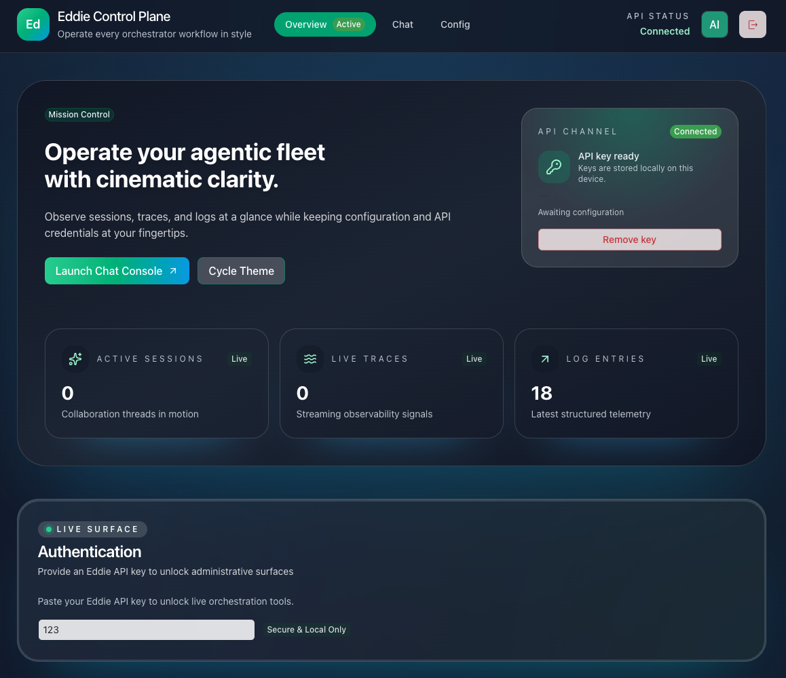

# Eddie: Multi-surface Agent Platform

Eddie unifies command-line power, hosted APIs, and a collaborative web workspace into a single agent platform. The CLI hydrates
prompts with repository context, the NestJS API hosts shared agents and tooling, and the web UI visualises every run so teams can
triage, replay, and collaborate on automation.

**This project was authored entirely by AI collaborators.**

## Surface overview

### Command Line Interface

The CLI remains the fastest way to experiment locally. It streams tool and model events in real time, honours configuration from
`eddie.config.*`, and produces JSONL traces that any surface can replay. Developer ergonomics come from a Nest application context
that provides dependency injection, consistent logging, and lifecycle hooks for tools and agents.

### API Services

The NestJS API exposes REST and WebSocket entry points for hosted automations, multi-agent orchestration, and shared tool
registries. It reuses the same configuration and tracing primitives as the CLI, letting you deploy the same workflows on
servers, CI pipelines, or collaborative environments without rewriting prompts.

Session management endpoints let you rename or delete chat sessions remotely while keeping connected clients in sync via
`session.updated` and `session.deleted` events.

#### Persistence drivers

Set `api.persistence.driver` to control how chat sessions and messages are stored. Memory mode keeps everything ephemeral for
tests, while `sqlite`, `postgres`, `mysql`, and `mariadb` reuse the shared Knex-powered persistence layer. The runtime ships with
`better-sqlite3`, `pg`, and `mysql2`; container images may still need the system packages required by those native bindings.
Provide credentials inline or via environment interpolation (for example `${PGHOST}`, `${MYSQL_USER}`, `${MARIADB_PASSWORD}`),
and toggle TLS by setting the optional `ssl` flag on each driver. When SQL persistence is enabled the API automatically runs the
pending migrations in `apps/api/migrations` during startup so regular `npm run api:start` deployments keep the schema current.
See [docs/api.md](docs/api.md) for driver-specific YAML examples and migration notes.

### Web UI

The React-powered UI layers conversation management on top of the API. It includes a prompt builder with live context previews,
run history with diff visualisation, environment configuration editors, and trace inspection tools for every agent iteration.
It is ideal for product teams who want to approve tool calls, share transcripts, or debug complex workflows together.
Use the session list to rename or delete chat sessions; changes are broadcast immediately to the CLI and API subscribers.

## Features

- Multi-surface agent orchestration across CLI, API, and browser
- Provider-agnostic model adapters (OpenAI, Anthropic, Groq-compatible) with streaming support
- Context service that packs workspace files via glob patterns, budgets tokens, and feeds models rich snippets
- Tool registry with built-in helpers for shell access, workspace files, and plan workflows:
  - `bash` for streaming shell commands with confirmation prompts
  - `file_read` for inspecting existing files without side effects
  - `file_write` for applying structured edits to tracked files
  - `file_search` for filtered, paginated code and text lookups
  - `get_folder_tree_structure` for directory maps that respect dependency exclusions
  - `get_plan` for reading structured task plans maintained alongside code
  - `agent__get_task_list` for retrieving shared task lists with optional abridged summaries
  - `agent__new_task_list` for seeding workspace task documents with optional metadata
  - `agent__new_task` for inserting work items with metadata, summaries, and ordering hints
  - `agent__set_task_status` for updating workflow states with confirmation prompts
  - `agent__delete_task` for removing completed or invalid tasks after review
  - `agent__new_task_list` for seeding workspace task documents with optional metadata
  - `update_plan` for incrementally persisting plan edits and status changes
  - `complete_task` for marking plan items finished with optional notes
- Jinja prompt templating with reusable layouts, partials, and inline variables
- Nested agent orchestrator that lets manager agents spawn task-specific subagents with their own prompts, context slices, and tools
- Lifecycle hooks, optional OpenTelemetry spans, and JSONL traces for observability that every surface can replay
- Interactive chat, single-shot prompts, context previews, automated run mode, and collaborative UI approvals

Mem0-powered long-term memory is available across surfaces when you supply API
credentials and point the runtime at a Qdrant collection. Configure the
`memory.mem0` block and vector store pairing as described in
[docs/configuration.md#memory-configuration](docs/configuration.md#memory-configuration)
to start syncing recall data to Mem0 while keeping CLI overrides available for
per-run testing.【F:platform/runtime/engine/src/engine.module.ts†L101-L170】【F:docs/configuration.md†L39-L87】

## Performance benchmarks

Continuous performance tracking lives in the [`benchmarks.yml`](.github/workflows/benchmarks.yml)
workflow. Every push to `main` (and the scheduled weekly run) provisions SQLite,
PostgreSQL, MySQL, and MariaDB backends, executes

```
BENCHMARK_OUTPUT_PATH=platform/testing/perf-benchmarks/benchmark-results.json \
  npm run bench --workspace @eddie/perf-benchmarks -- --run --reporter=./src/benchmark-action.reporter.ts
```

and publishes regression charts to the [`benchmarks` branch](https://github.com/Teagan42/Eddie/tree/benchmarks).
Results are rendered on GitHub Pages so trends remain visible between releases,
while the raw JSON is attached to the workflow run for offline analysis.

Omit `BENCHMARK_OUTPUT_PATH` for quick local runs when you do not need to
persist the JSON payload.

The benchmark action raises regression alerts whenever a metric degrades by 5%
or more compared to the last successful run. Alerts fail the workflow and leave
an annotated comment on the offending commit so maintainers can respond quickly.
See [docs/performance-benchmarks.md](docs/performance-benchmarks.md) for guidance
on reading the charts and interpreting alert notifications.

## Docker setup

Run the platform without installing Node by building the workspace image and launching the API through Docker Compose:

```bash
docker compose up -d
docker compose logs -f api
```

The compose file targets the `development` stage in the shared Dockerfile, mounts the repository into the container for live reloads, and exposes the API on port 3000. Switch to the production stage with `--profile production` to boot the API with compiled artifacts and production dependencies only. Review `docker-compose.yml` for port mappings, environment variables, and volume overrides that fit your environment.

## Web UI

Start the full-stack experience locally by running the API and UI together:

```bash
npm run dev
```

This command launches the Nest API and the Vite-powered UI with hot reloads. When running the surfaces independently, use
`npm run api:dev` or `npm run api:start` for the backend and `npm run web:dev` or `npm run web:start` for the frontend.

- Navigate to `http://localhost:4200` to access the dashboard.
- Connect the UI to a configured API environment or switch providers directly from the sidebar.
- Replay prior runs, inspect the structured trace viewer, and promote successful automations to shared templates.




Refer to [docs/web-ui.md](docs/web-ui.md) for advanced deployment guidance, environment variables, and authentication
recommendations.

### Demo overview screenshots

Run the API and UI against the demo screenshot preset before launching the Playwright suite so the overview page hydrates with
seeded sessions, traces, and logs:

```bash
npm run api:dev -- --preset demo-screenshots
npm run web:dev
PLAYWRIGHT_BASE_URL=http://127.0.0.1:5173 \
PLAYWRIGHT_API_BASE_URL=http://127.0.0.1:3000/api \
npm run --workspace @eddie/web test:e2e -- demo-overview.spec.ts
```

The E2E fixtures wait for `/api/chat-sessions` to report data and attach PNG screenshots to `apps/web/test-results/` whenever the
assertions succeed, keeping the marketing assets reproducible.

## Getting Started

Requires Node.js 20 or newer (Node 22 is used in development and CI). The bundled dependencies rely on modern ESM support that is
not available in Node 18.

1. Install dependencies and compile the Nest application. The `build` script runs `nest build`, emitting the `apps/cli/dist/main.js`
binary that is also published as the `eddie` executable.

   ```bash
   npm install
   npm run build
   ```

2. Execute commands through the compiled binary (or via `npm exec eddie`):

   ```bash
   node apps/cli/dist/main.js ask "Summarize apps/cli/src/core/engine/engine.service.ts"
   # or
   npm exec -- eddie context --context "src/**/*.ts"
   ```

3. For local development with hot-reload, start the Nest CLI wrapper:

   ```bash
   npm run dev -- ask "Summarize apps/cli/src/core/engine/engine.service.ts"
   ```

## Configuration

Eddie loads configuration from `eddie.config.(json|yaml)` in your project root
and merges it with the defaults defined in `platform/core/config/src/defaults.ts`. CLI flags
still win for per-run overrides (for example `--model`, `--provider`,
`--context`, `--auto-approve`, `--jsonl-trace`).

Every top-level key in `EddieConfig` serves a specific subsystem:

- **`model` / `provider`** – Default model name and provider credentials used
  when no agent overrides are supplied.
- **`providers`** – Named provider profiles (`Record<string, ProviderProfileConfig>`) for
  multi-provider routing; each profile can declare its own API key, base URL, or
  model version.
- **`context`** – Globs, limits, and reusable bundles that determine what files
  flow into prompts.
- **`systemPrompt`** – The base prompt injected into the primary agent.
- **`logLevel`** – Baseline verbosity for all loggers.
- **`logging`** – Destination (`stdout`, `stderr`, or `file` with optional path),
  pretty-print, color, and timestamp settings for the structured logger.
- **`output`** – JSONL trace location, append mode, pretty stream toggle, and
  optional working directory for artifacts.
- **`tools`** – Lists of enabled or disabled tool identifiers, auto-approve
  behaviour, and `sources` for external providers (including MCP servers).
- **`hooks`** – Module list and optional directory scanned for lifecycle hook
  implementations.
- **`tokenizer`** – Provider used when computing token budgets.
- **`memory`** – Global toggle, facet extraction defaults, and vector store
  connection settings shared across agents, with per-agent overrides available
  under `agents.manager.memory` and each subagent definition.
- **`agents`** – The agent manager prompt, subagent definitions, routing knobs,
  and an enable/disable switch for hierarchical execution.

### Cross-references & maintenance

- Deep dives on subagents live in [docs/subagents.md](docs/subagents.md).
- Adding MCP tool servers is covered in [docs/mcp-servers.md](docs/mcp-servers.md).
- Prompt/context templating is documented in [docs/templates.md](docs/templates.md).
- Running the Web UI against the API stack is covered in [docs/web-ui.md](docs/web-ui.md).
- The configuration wizard walkthrough lives in
  [docs/configuration-wizard.md](docs/configuration-wizard.md).

Whenever you add a new configuration key in `platform/core/config/src/types.ts`, update this
section, `DEFAULT_CONFIG`, and any impacted guides so the documentation stays in
sync with the runtime expectations.

### Example: multi-provider project with file logging

```yaml
model: gpt-4o-mini
provider:
  name: openai
providers:
  anthropic-prod:
    provider:
      name: anthropic
      apiKey: ${ANTHROPIC_API_KEY}
    model: claude-3-5-sonnet-latest
context:
  include:
    - "src/**/*.ts"
  exclude:
    - "dist/**"
  maxBytes: 200000
systemPrompt: "You are Eddie, a CLI coding assistant."
logLevel: info
logging:
  level: debug
  destination:
    type: file
    path: .eddie/logs/run.log
    pretty: false
  enableTimestamps: true
output:
  jsonlTrace: .eddie/trace.jsonl
  jsonlAppend: true
tools:
  enabled: ["file_read", "file_write"]
  disabled: ["bash"] # temporarily disable bash during CI runs
hooks:
  modules:
    - "./dist/hooks/audit.js"
  directory: "./hooks"
tokenizer:
  provider: openai
agents:
  mode: single
  manager:
    prompt: "Review the diff and suggest improvements."
  subagents: []
  routing:
    confidenceThreshold: 0.6
  enableSubagents: false
```

### Example: MCP-powered tooling with agent routing

```yaml
model: gpt-4o-mini
provider:
  name: openai
context:
  include:
    - "src/**/*.ts"
  variables:
    repoName: eddie
tools:
  enabled: ["bash", "file_read", "file_write", "mcp:filesystem"]
  sources:
    - id: local-fs
      type: mcp
      url: http://localhost:3001
      name: Local Filesystem
      headers:
        Authorization: Bearer ${MCP_TOKEN}
      capabilities:
        tools:
          file_search:
            maxResults: 50
hooks:
  directory: "./hooks"
tokenizer:
  provider: tiktoken
agents:
  mode: router
  manager:
    prompt: "Coordinate the right specialist for each task."
  subagents:
    - id: code-reviewer
      prompt: "Review pull requests for quality and style."
      tools: ["file_read", "file_write"]
    - id: test-runner
      prompt: "Execute relevant tests and summarise the output."
      tools: ["bash"]
  routing:
    confidenceThreshold: 0.55
    maxDepth: 3
  enableSubagents: true
output:
  prettyStream: true
```

## Commands

- `eddie ask <prompt>` – Single prompt, streams the response
- `eddie run <prompt>` – Same as ask but designed for tool-heavy automation
- `eddie chat` – Interactive multi-turn session retaining history
- `eddie context` – Preview which files/globs will be sent as context
- `eddie trace` – Inspect the most recent JSONL trace file
- `eddie config` – Launch the interactive [configuration wizard](docs/configuration-wizard.md) to scaffold config files

## Observability & Agent Hierarchies

Every provider invocation is recorded as an agent phase in the JSONL trace when
`output.jsonlTrace` (or `--jsonl-trace`) is set. The orchestrator now writes
structured records for `agent_start`, `model_call`, `tool_call`, `tool_result`,
`iteration_complete`, and `agent_complete`, each tagged with metadata about the
agent's depth, parent identifier, configured tools, prompt, and context budget.
This makes it straightforward to reconstruct parent/child relationships or to
surface tool output during debugging. The accompanying `eddie trace` command can
be pointed at the file to inspect each phase interactively.

Hook modules can subscribe to the new lifecycle events—`beforeAgentStart`,
`afterAgentComplete`, and `onAgentError`—to stream the same metadata elsewhere
for dashboards or policy enforcement. Object-based hook modules exported from
your project can now register handlers for these events directly:

```ts
export default {
  async beforeAgentStart(payload) {
    console.log("agent starting", payload.metadata.id, payload.metadata.depth);
  },
  async afterAgentComplete(payload) {
    console.log("agent finished", payload.metadata.id, payload.iterations);
  },
  onAgentError(payload) {
    console.error("agent failed", payload.metadata.id, payload.error.message);
  },
};
```

Every payload includes the agent's prompt, context summary, history length, and
sanitised metadata so downstream systems can observe full hierarchies without
needing internal Eddie classes.

### Hook event naming

Hook identifiers are now canonicalised as camelCase strings. Import
`HOOK_EVENTS` from the published `eddie/hooks` entrypoint (or directly from
`apps/cli/src/hooks` when working inside this repository) to avoid typos and stay
aligned with future additions:

```ts
import { HOOK_EVENTS } from "eddie/hooks";

export default {
  [HOOK_EVENTS.sessionStart]: (payload) => {
    // session metadata + runtime config
  },
  [HOOK_EVENTS.userPromptSubmit]: (payload) => {
    // prompt text and history length
  },
  [HOOK_EVENTS.afterAgentComplete]: (payload) => {
    // agent transcript and iteration counts
  },
};
```

The existing PascalCase spellings (`SessionStart`, `PreToolUse`, `Stop`, etc.)
are still accepted for the current release and emit a deprecation warning when
loaded. They will be removed after the next minor release, so update custom
hook modules to the camelCase variants soon to avoid interruptions.

## Testing

```bash
npm run lint
npm test
```

Vitest covers utilities such as secret redaction, provider wiring, and CLI behaviours, while ESLint enforces the shared Nest coding standards.

`npm run lint` also runs a third-party license audit, failing if the checked-in `THIRD_PARTY_NOTICES.md` file needs regeneration. Regenerate the notices with `npm run licenses:write` whenever dependencies change.

## Documentation

- [Adding MCP servers](docs/mcp-servers.md)
- [Subagents guide](docs/subagents.md)
- [Prompt and context templates](docs/templates.md)
- [CLI options reference](docs/cli-reference.md)
- [Nest CLI migration guide](docs/migration/cli-nest-refactor.md)

If you are upgrading from the legacy Commander-based CLI, review the migration
guide above for details on environment variables, configuration file lookup,
and build steps.

## License

Licensed under the Business Source License 1.1 (change date 2029-01-01, change license Apache 2.0) © 2025 ConstructorFleet L.L.C
