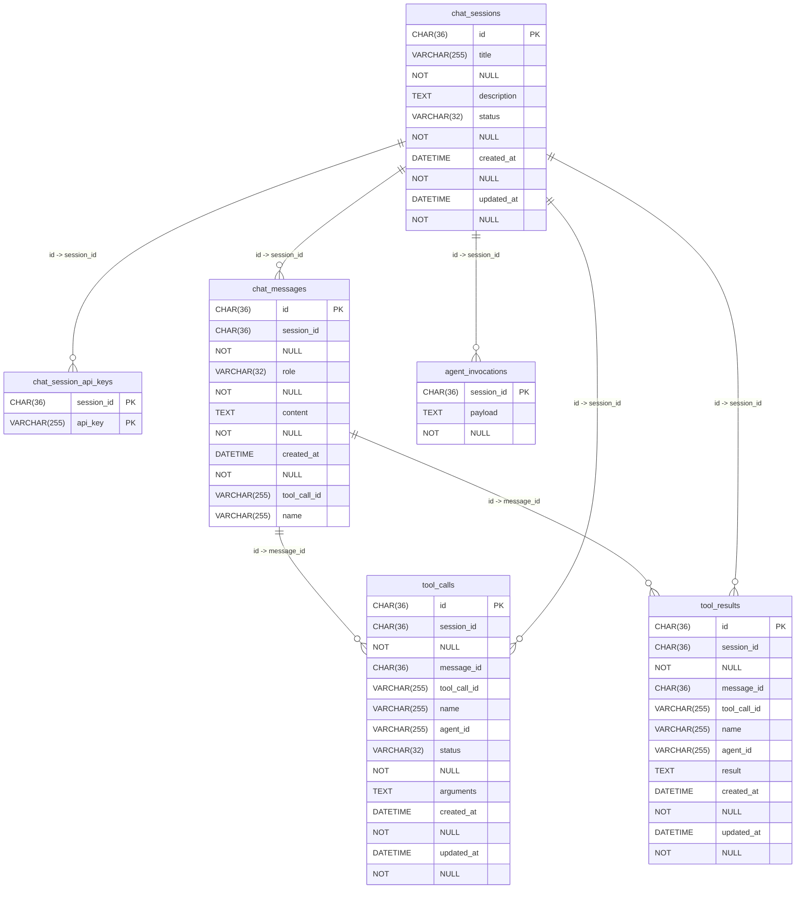

<!-- Auto-generated by apps/api/scripts/render-database-diagram.ts -->
<!-- Run `npm run docs:database-diagram` to regenerate -->

```mermaid
%% Auto-generated by apps/api/scripts/render-database-diagram.ts
%% Run `npm run docs:database-diagram` to regenerate
erDiagram
  chat_sessions {
    CHAR(36) id PK
    VARCHAR(255) title NOT NULL
    TEXT description
    VARCHAR(32) status NOT NULL
    DATETIME created_at NOT NULL
    DATETIME updated_at NOT NULL
  }

  chat_session_api_keys {
    CHAR(36) session_id PK
    VARCHAR(255) api_key PK
  }

  chat_messages {
    CHAR(36) id PK
    CHAR(36) session_id NOT NULL
    VARCHAR(32) role NOT NULL
    TEXT content NOT NULL
    DATETIME created_at NOT NULL
    VARCHAR(255) tool_call_id
    VARCHAR(255) name
  }

  agent_invocations {
    CHAR(36) session_id PK
    TEXT payload NOT NULL
  }

  tool_calls {
    CHAR(36) id PK
    CHAR(36) session_id NOT NULL
    CHAR(36) message_id
    VARCHAR(255) tool_call_id
    VARCHAR(255) name
    VARCHAR(255) agent_id
    VARCHAR(32) status NOT NULL
    TEXT arguments
    DATETIME created_at NOT NULL
    DATETIME updated_at NOT NULL
  }

  tool_results {
    CHAR(36) id PK
    CHAR(36) session_id NOT NULL
    CHAR(36) message_id
    VARCHAR(255) tool_call_id
    VARCHAR(255) name
    VARCHAR(255) agent_id
    TEXT result
    DATETIME created_at NOT NULL
    DATETIME updated_at NOT NULL
  }
  chat_sessions ||--o{ chat_session_api_keys : "id -> session_id"
  chat_sessions ||--o{ chat_messages : "id -> session_id"
  chat_sessions ||--o{ agent_invocations : "id -> session_id"
  chat_messages ||--o{ tool_calls : "id -> message_id"
  chat_sessions ||--o{ tool_calls : "id -> session_id"
  chat_messages ||--o{ tool_results : "id -> message_id"
  chat_sessions ||--o{ tool_results : "id -> session_id"
```
