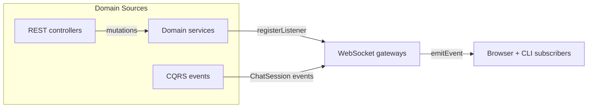

# API Realtime Gateway Baseline

This note captures how the existing NestJS gateways broadcast realtime state so we can design the CQRS-oriented refresh without
breaking clients. Every gateway relies on the shared `emitEvent` helper, which JSON-encodes `{ event, data }` envelopes and sends
them to each open WebSocket client. All outbound streams therefore use the same WebSocket transport semantics today.

## Gateway Catalog

### Chat Sessions Gateway
- **Inbound Triggers:** Registered as a `ChatSessionsListener` during `onModuleInit`, so any mutation routed through
  `ChatSessionsService` (create/update/delete sessions, add/update messages, set agent activity) fan out to the gateway. It also
  handles direct client actions by subscribing to the `message.send` socket message and piping payloads back into
  `ChatSessionsService.addMessage`. 【F:apps/api/src/chat-sessions/chat-sessions.gateway.ts†L1-L76】【F:apps/api/src/chat-sessions/chat-sessions.service.ts†L31-L198】
- **Listeners:** Implements the full listener interface, emitting `session.created`, `session.updated`, `session.deleted`,
  `message.created`, `message.updated`, and `agent.activity` events through the shared `emitEvent` transport. 【F:apps/api/src/chat-sessions/chat-sessions.gateway.ts†L32-L66】【F:apps/api/src/websocket/utils.ts†L1-L22】
- **Transports:** Exposes a WebSocket gateway on `/chat-sessions`; inbound frames use the Nest `@SubscribeMessage`
  dispatcher, while outbound messages are JSON envelopes with `{ event, data }`. 【F:apps/api/src/chat-sessions/chat-sessions.gateway.ts†L22-L76】【F:apps/api/src/websocket/utils.ts†L8-L22】
- **Module Wiring:** Provided by `ChatSessionsModule`, which also supplies `ChatSessionsService`, the CQRS event handler, stream
  renderer, `ChatMessagesGateway`, and imports `EngineModule`, `TracesModule`, `LogsModule`, `ConfigModule`, `ToolsModule`,
  `DatabaseModule`, and `CqrsModule`. This keeps the gateway connected to persistence, engine orchestration, and tool bridges.
  【F:apps/api/src/chat-sessions/chat-sessions.module.ts†L1-L98】

### Chat Messages Gateway
- **Inbound Triggers:** Does not register listeners itself; instead `ChatSessionEventsService` handles CQRS events from the engine
  pipeline and invokes `emitPartial` when it receives a `ChatMessagePartialEvent`. 【F:apps/api/src/chat-sessions/chat-messages.gateway.ts†L1-L14】【F:apps/api/src/chat-sessions/chat-session-events.service.ts†L1-L87】
- **Listeners:** Only emits the `message.partial` event that streams assistant tokens. 【F:apps/api/src/chat-sessions/chat-messages.gateway.ts†L1-L14】
- **Transports:** Lightweight gateway at `/chat-messages` using the shared `emitEvent` helper. 【F:apps/api/src/chat-sessions/chat-messages.gateway.ts†L1-L14】【F:apps/api/src/websocket/utils.ts†L8-L22】
- **Module Wiring:** Declared alongside the chat sessions gateway in `ChatSessionsModule`, allowing CQRS handlers to access it via
  Nest dependency injection. 【F:apps/api/src/chat-sessions/chat-sessions.module.ts†L60-L98】

### Traces Gateway
- **Inbound Triggers:** Subscribed via `TracesGatewayEventsHandler`, which listens for `TraceCreated` and `TraceUpdated` CQRS domain events emitted by the trace command handlers. 【F:apps/api/src/traces/traces.gateway.events-handler.ts†L1-L37】【F:apps/api/src/traces/commands/create-trace.handler.ts†L1-L24】【F:apps/api/src/traces/commands/update-trace.handler.ts†L1-L26】
- **Listeners:** Emits `trace.created` and `trace.updated` events to connected clients. 【F:apps/api/src/traces/traces.gateway.ts†L31-L38】
- **Transports:** WebSocket gateway on `/traces` using the shared broadcast helper. 【F:apps/api/src/traces/traces.gateway.ts†L12-L38】【F:apps/api/src/websocket/utils.ts†L8-L22】
- **Module Wiring:** `TracesModule` imports the CQRS module and registers the trace command/query handlers plus the gateway events handler alongside the service. 【F:apps/api/src/traces/traces.module.ts†L1-L23】

### Runtime Config Gateway
- **Inbound Triggers:** Subscribes to the `RuntimeConfigService.changes$` observable during `onModuleInit`; any update pushed into
  the store (via REST controller or other providers) flows to the gateway. 【F:apps/api/src/runtime-config/runtime-config.gateway.ts†L1-L33】【F:apps/api/src/runtime-config/runtime-config.service.ts†L12-L54】
- **Listeners:** Emits a single `config.updated` event containing the new snapshot. 【F:apps/api/src/runtime-config/runtime-config.gateway.ts†L12-L31】
- **Transports:** WebSocket endpoint at `/config`, again using the shared JSON envelope helper. 【F:apps/api/src/runtime-config/runtime-config.gateway.ts†L12-L31】【F:apps/api/src/websocket/utils.ts†L8-L22】
- **Module Wiring:** `RuntimeConfigModule` wires the gateway with the config store factory and service by importing Nest
  `ConfigModule.forFeature(runtimeConfig)` and exporting the service for wider use. 【F:apps/api/src/runtime-config/runtime-config.module.ts†L1-L27】

### Tools Gateway
- **Inbound Triggers:** Invoked by `ChatSessionEventsService`, which listens for `ChatSessionToolCallEvent` and
  `ChatSessionToolResultEvent` CQRS notifications from the engine. Payloads are sanitised (stringified arguments/results and
  timestamp defaulting) before emission. 【F:apps/api/src/tools/tools.gateway.ts†L1-L74】【F:apps/api/src/chat-sessions/chat-session-events.service.ts†L1-L87】
- **Listeners:** Exposes imperative methods `emitToolCall` and `emitToolResult`; the gateway itself does not subscribe to other
  providers beyond being injected into the CQRS handler. 【F:apps/api/src/tools/tools.gateway.ts†L12-L74】
- **Transports:** WebSocket gateway at `/tools` sending `tool.call` and `tool.result` envelopes via the shared helper. Payloads are
  truncated to ~2k characters to protect the transport. 【F:apps/api/src/tools/tools.gateway.ts†L12-L74】【F:apps/api/src/websocket/utils.ts†L8-L22】
- **Module Wiring:** Provided and exported by `ToolsModule`, enabling other features (chat sessions) to request it. The module
  keeps its dependency surface small—no imports, only the gateway provider. 【F:apps/api/src/tools/tools.module.ts†L1-L8】

## Registration Summary

| Module | Imported Dependencies | Gateway Providers | Primary Consumers |
| --- | --- | --- | --- |
| `ChatSessionsModule` | Engine, Traces, Logs, Config, Tools, Database, Cqrs | `ChatSessionsGateway`, `ChatMessagesGateway` | REST controller, CQRS handlers, engine listener |
| `TracesModule` | *(none)* | `TracesGateway` | Chat session engine listener, REST controller |
| `RuntimeConfigModule` | `ConfigModule.forFeature(runtimeConfig)` | `RuntimeConfigGateway` | Runtime config controller, config store |
| `ToolsModule` | *(none)* | `ToolsGateway` | Chat session CQRS event handler |

These baselines highlight that today’s realtime story is tightly coupled to imperative service listeners and module-level
singletons. The CQRS redesign can reuse the shared WebSocket transport while separating trigger sources into explicit command and
event handlers.
